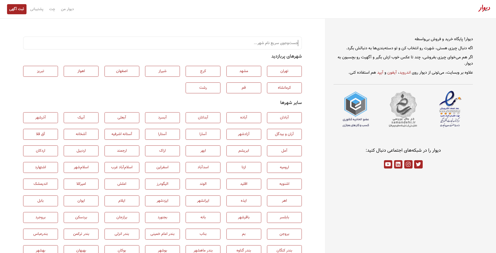

<h1 align="center">Divar Clone</h1>

> disclaimer: this is a unfinished project and does not contain all divar.ir features

more screenshots [here](./screenshots)

## Technologies

- React
- firebase
- Redux
- React-Router
- Vite
- typescript
- sass
- leaflet Map

## Setting up development environment 🛠

1. clone the project and cd into folder

2. type `npm install` or `yarn install`

3. go to your firebase console and create a new project

4. rename `.env.example` to `.env` and then replace with your project firebase credentials

5. type `npm run start` or `yarn start` for development

6. type `npm run build` or `yarn build` for production

## License

[MIT](https://opensource.org/licenses/MIT)
